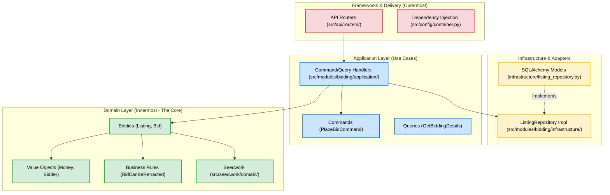

# Chapter 1: The Big Picture & Core Domain Modeling

Welcome to Chapter 1! In this chapter, we will connect the abstract concepts from **Cosmic Python** to the actual code inside your `python-ddd` repository. 

Our focus today is **Clean Architecture** and the most fundamental building blocks of Domain-Driven Design (DDD): **Entities** and **Value Objects**.

---

## Part 1: Clean Architecture & The Dependency Rule

### What is Clean Architecture?

At its core, Clean Architecture is about **isolation**. It ensures that your core business logic (the "Domain") does not care about your database (PostgreSQL, SQLite), your web framework (FastAPI, Flask), or how a user interacts with the system (Web, CLI, WhatsApp). 

If you decide to swap out PostgreSQL for MongoDB, or FastAPI for a WhatsApp bot, your business rules should not change by even a single line of code.

### 📚 Book Reference
> **Cosmic Python, Chapter 1**: *"Domain Modeling"* 
> Discusses why we must encapsulate business logic away from infrastructure.

### The Concentric Circles

Clean Architecture is usually visualized as concentric circles. Let's look at how the `python-ddd` repository maps to these layers:

```text
┌─────────────────────────────────────────────────────────────┐
│                    FRAMEWORKS & DRIVERS                      │
│  (the outermost ring — the "plumbing")                      │
│                                                             │
│  api/routers/     → FastAPI HTTP endpoints                  │
│  config/          → Dependency Injection Container          │
│                                                             │
│  ┌─────────────────────────────────────────────────────┐    │
│  │              INTERFACE ADAPTERS                      │    │
│  │  (translates between core and outside world)        │    │
│  │                                                     │    │
│  │  modules/.../infrastructure/ → SQL Alchemy Repos     │    │
│  │  seedwork/infrastructure/    → Data Mappers          │    │
│  │                                                     │    │
│  │  ┌─────────────────────────────────────────────┐    │    │
│  │  │          APPLICATION LAYER                   │    │    │
│  │  │  (orchestrates domain objects)               │    │    │
│  │  │                                              │    │    │
│  │  │  modules/.../application/command/            │    │    │
│  │  │  modules/.../application/query/              │    │    │
│  │  │  seedwork/application/                       │    │    │
│  │  │                                              │    │    │
│  │  │  ┌─────────────────────────────────────┐     │    │    │
│  │  │  │        DOMAIN LAYER (the core)       │     │    │    │
│  │  │  │  (pure business rules)               │     │    │    │
│  │  │  │                                      │     │    │    │
│  │  │  │  modules/.../domain/entities.py      │     │    │    │
│  │  │  │  modules/.../domain/rules.py         │     │    │    │
│  │  │  │  seedwork/domain/                    │     │    │    │
│  │  │  └─────────────────────────────────────┘     │    │    │
│  │  └─────────────────────────────────────────────┘    │    │
│  └─────────────────────────────────────────────────────┘    │
└─────────────────────────────────────────────────────────────┘
```

Here is the same concept illustrated visually. Notice how the flow of control moves inward:



### ⚡ The Golden Rule: The Dependency Rule

> **Source code dependencies must point INWARD. Nothing in an inner circle can know anything about an outer circle.**

This means:
*   ✅ **Domain** code (like `Listing`) can only import from other **Domain** code or `seedwork` (which is just base domain code).
*   ✅ **Application** code (like `place_bid.py`) can import from **Domain**.
*   ✅ **Infrastructure** code can import from **Domain** and **Application** to know what interfaces to implement.
*   ❌ **Domain** code MUST NEVER import SQLAlchemy, FastAPI, or any HTTP libraries.

---

## Part 2: Seedwork vs. Modules

Unlike the `clean-architecture` repo, `python-ddd` has a brilliant structural feature: **`src/seedwork/`**.

*   **`src/seedwork/`**: Contains the abstract, reusable base classes for DDD (like `Entity`, `ValueObject`, `AggregateRoot`). You can copy this folder into *any* future project to instantly get a DDD foundation.
*   **`src/modules/`**: Contains the actual business implementations (like `bidding` and `catalog`).

---

## Part 3: Entities & Value Objects

These are the innermost building blocks of your Domain Layer. 

### 1. What is an Entity?

> **An Entity is an object defined by its identity (its ID), not its attributes. Two entities with the same attributes but different IDs are NOT the same thing.**

**Analogy:** You and someone else might share the same name, age, and hair color, but you have different ID numbers. You are different entities.

**In the codebase:** Look at [src/modules/bidding/domain/entities.py](../src/modules/bidding/domain/entities.py). The `Listing` class is an Entity (specifically, an `AggregateRoot`, which is a special type of Entity we'll discuss later).

```python
# From src/seedwork/domain/entities.py
@dataclass
class Entity(Generic[EntityId]):
    id: EntityId = field(hash=True)  # <--- The ID defines the Entity

# From src/modules/bidding/domain/entities.py
@dataclass(kw_only=True)
class Listing(AggregateRoot[GenericUUID]):
    seller: Seller
    ask_price: Money
    starts_at: datetime
    ends_at: datetime
    bids: list[Bid] = field(default_factory=list)
```
Notice what is *missing* here: There is absolutely zero mention of databases, columns, strings, or SQLAlchemy. It is pure Python modeling pure business logic.

### 2. What is a Value Object?

> **A Value Object is defined purely by its attributes. It does not have an identity (no ID). Two Value Objects with the exact same attributes ARE the same thing.**

**Analogy:** A $10 bill is a Value Object. If I swap my $10 bill for your $10 bill, neither of us cares. We only care about the *value* ($10), not the specific serial number of the bill.

**In the codebase:** Look at [src/seedwork/domain/value_objects.py](../src/seedwork/domain/value_objects.py). 

```python
@dataclass(frozen=True)
class Money(ValueObject):
    amount: int = 0
    currency: str = "USD"

    def __eq__(self, other):
        self._check_currency(other)
        return self.amount == other.amount # <--- Equality is based on attributes!
```

Value objects should ideally be **immutable** (`frozen=True`). If you need $20 instead of $10, you don't change the $10 bill; you throw it away and create a new $20 bill.

Look at [src/modules/bidding/domain/value_objects.py](../src/modules/bidding/domain/value_objects.py). Notice how `Bidder` is just a wrapped UUID? This prevents you from accidentally passing a `Seller` ID into a function that expects a `Bidder` ID, even though both are just UUIDs under the hood!

```python
@dataclass(frozen=True)
class Bidder(ValueObject):
    id: GenericUUID
```

---

## Part 4: Bounded Contexts — Where is the User?

You might be wondering: *"In a normal application, the `User` is the most fundamental model. Why isn't `User` the center of the Domain here? Why do we have `Bidder` and `Seller` instead?"*

This is one of the most powerful concepts in DDD, known as **Bounded Contexts** (covered later in Cosmic Python Chapter 14). 

In traditional CRUD apps, the `User` table becomes a massive "God Object" that knows about passwords, billing, bids, listings, and notifications. 

DDD solves this by dividing the system into distinct boundaries (modules), where concepts mean different things:
*   **In the `iam` (Identity & Access Management) module:** The concept of a `User` exists. It cares about emails, hashed passwords, and authentication tokens.
*   **In the `bidding` module:** The system does not care about passwords or emails. It only cares whether an ID is acting as a `Bidder` or a `Seller` for a specific auction.
*   **In the `catalog` module:** The system cares about the `Seller` creating a draft.

Because the Bidding module doesn't care about authentication, it **does not import the User entity**. Instead, it models `Bidder` and `Seller` as simple **Value Objects** that just hold a UUID. The Bidding module trusts that the outer layers (the API routing and IAM module) have already authenticated the person making the request.

This prevents the Bidding code from ever accidentally modifying a user's password!

---

## 🧪 Hands-On Exercise #1

To cement these concepts, try the following exercises in the codebase:

### Exercise 1A: Trace the Dependency Rule
Open the following files and look purely at their `import` statements at the top. Verify the Dependency Rule is working:
1.  Open [src/modules/bidding/domain/entities.py](../src/modules/bidding/domain/entities.py). Notice it only imports from `datetime`, `dataclasses`, other `domain` files, and `seedwork`. No external libraries!
2.  Open [src/modules/bidding/infrastructure/listing_repository.py](../src/modules/bidding/infrastructure/listing_repository.py). Notice it imports from `sqlalchemy`. It also imports from the domain (`Listing`, `Bid`, `Money`) to know what objects to map the database rows into. The outer circle depends on the inner circle.

### Exercise 1B: Entity vs Value Object Check
1.  Why is a `Bid` considered a `ValueObject` in this codebase ([src/modules/bidding/domain/value_objects.py](../src/modules/bidding/domain/value_objects.py)), while `Listing` is an `Entity`? (Hint: Think about how eBay works. Does an individual bid need a global ID, or does it just belong to the Listing?)

---

## Part 5: CQRS & Where are the Use Cases?

If you have looked at other Clean Architecture repositories, you might be used to seeing a folder literally called `use_cases/` with files like `PlaceBidUseCase.py`. 

In `python-ddd`, you won't find a `use_cases` folder. Why? Because this repository implements a pattern called **CQRS (Command Query Responsibility Segregation)**.

CQRS dictates that every Use Case should be explicitly split into one of two categories:
1. **Commands:** Operations that *change* the state of the system (Write). e.g., Placing a bid, publishing a listing.
2. **Queries:** Operations that *read* the state of the system but do not change anything (Read). e.g., Viewing listing details.

### How to find a Use Case
Instead of a `use_cases` folder, look inside the `application/` layer of any module. You will see two folders: `command/` and `query/`.

**A "Use Case" in this codebase consists of two things:**
1. **The Message:** A simple data class representing the inputs (e.g., `PlaceBidCommand`).
2. **The Handler:** The actual execution logic of the Use Case, which is the function decorated with `@handler`.

**Example:** If you want to see the "Place Bid" Use Case, you look in `src/modules/bidding/application/command/place_bid.py`. The `async def place_bid()` handler function *is* the Use Case!

---

## Part 6: Where does TDD fit into this?

Test-Driven Development (TDD) and Domain-Driven Design (DDD) work perfectly together. Because the Domain Layer (Entities and Value Objects) has absolutely zero dependencies—no database, no FastAPI, no internet—we can write pure Python Unit Tests that run in *milliseconds*.

In traditional TDD, testing business logic requires spinning up a database and firing HTTP requests, which is slow and fragile. In DDD, you can instantiate a `Listing` in memory and assert its state instantly.

**TDD in Action:** Look at [src/modules/bidding/tests/domain/test_bidding.py](../src/modules/bidding/tests/domain/test_bidding.py). Notice how it tests pure Python classes without any database or framework setup!

### Running the Tests

To run the entire suite of Domain Layer tests (which covers everything in Chapters 1 & 2), run this from your terminal:
```bash
poe test_domain
```

To run a "micro-test" on a specific Entity behavior or business rule without running the whole suite, you can use standard `pytest` syntax to target a single file or function. For example:
```bash
pytest src/modules/bidding/tests/domain/test_bidding.py::test_place_one_bid
```

---

## Summary

*   **Clean Architecture** keeps your business rules safe from your database and web framework.
*   **The Dependency Rule** ensures outer layers depend on inner layers, never the reverse.
*   **Entities** have an ID and a lifespan.
*   **Value Objects** have no ID, are immutable, and are interchangeable if their attributes match.

> [!NOTE]  
> Take a look through the files mentioned in this chapter ([seedwork/domain/entities.py](../src/seedwork/domain/entities.py), [modules/bidding/domain/entities.py](../src/modules/bidding/domain/entities.py), [seedwork/domain/value_objects.py](../src/seedwork/domain/value_objects.py)). 
> 
> Let me know when you are ready for **Chapter 2**, where we will dive into how Business Rules are enforced and how Domain Events work!
