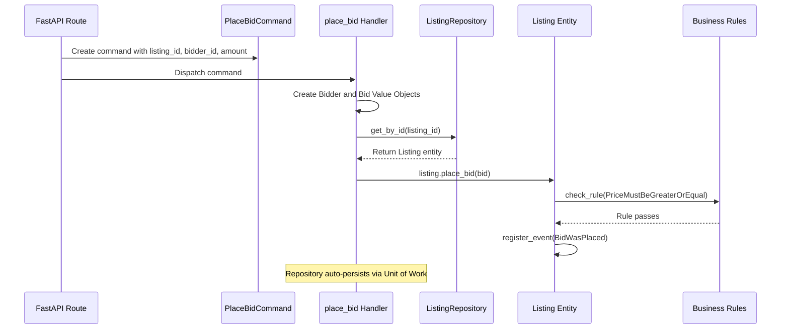
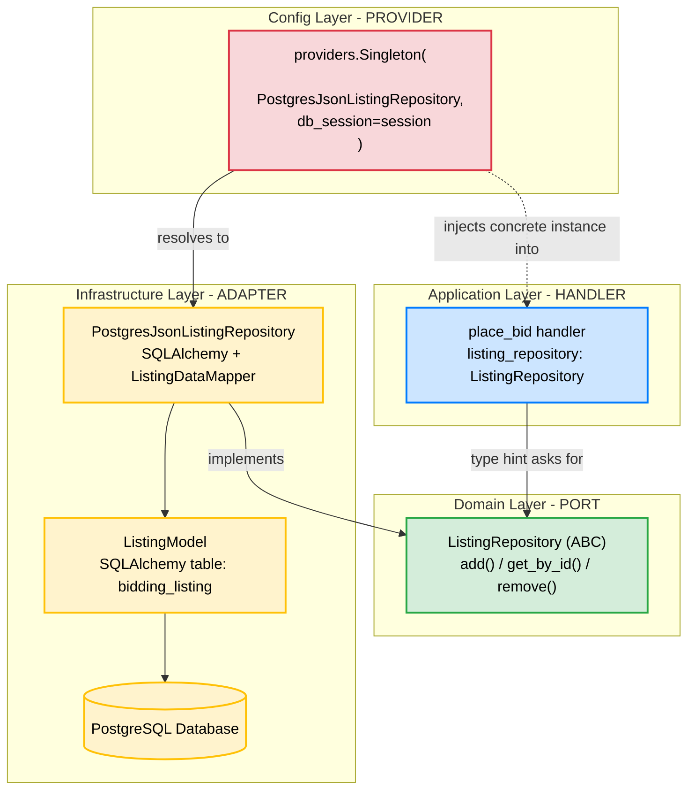
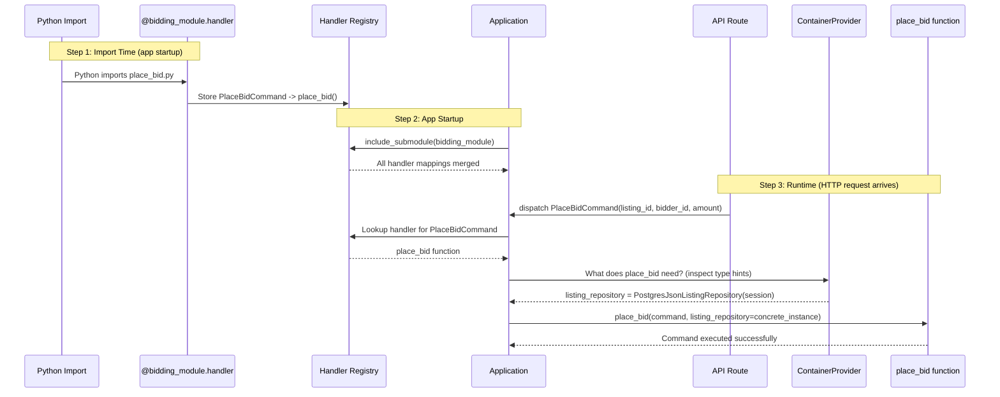
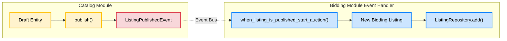
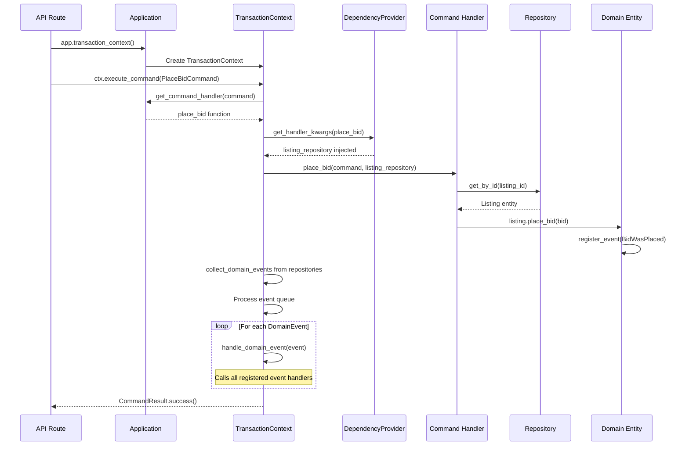
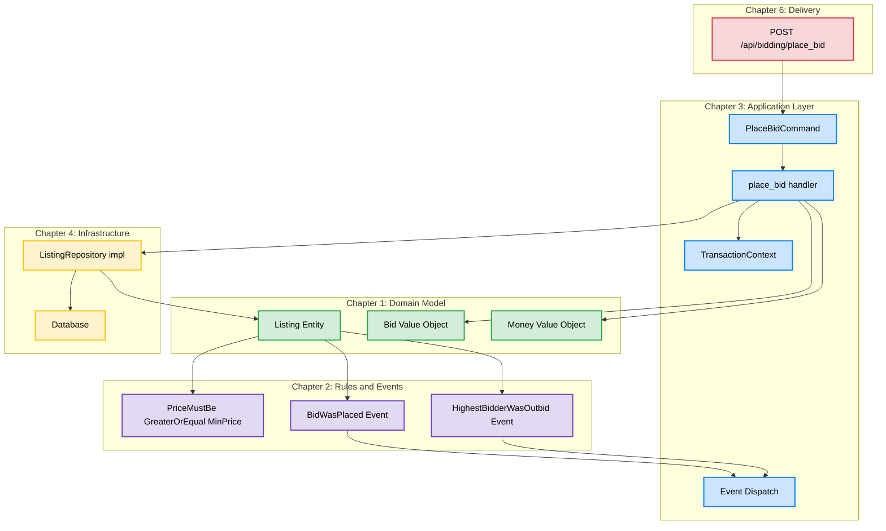

# Chapter 3: The Application Layer (Commands, Queries, and Use Cases)

Welcome to Chapter 3! In Chapters 1 and 2 we built the **Domain Layer** — the pure business core with Entities, Value Objects, Business Rules, and Domain Events. But the Domain doesn't do anything on its own. It needs an **orchestrator**.

That orchestrator is the **Application Layer**. It sits one ring outside the Domain in our Clean Architecture circles and is responsible for coordinating use cases without containing any business logic itself.

---

## Part 1: What is the Application Layer?

The Application Layer is the **thin orchestration layer** between the outside world (APIs, CLIs, UIs) and your pure Domain model. Think of it as a **movie director**: it tells the actors (Domain objects) what scene to perform, but it doesn't act itself.

### 📚 Book Reference
> **Cosmic Python, Chapter 4 & 11**: *"Service Layer"* and *"CQRS"*
> Discusses how to create a thin service/application layer that orchestrates domain objects and how to separate reads from writes.

### What the Application Layer Does

| Responsibility | Example in Codebase |
|---|---|
| Accept a request from the outside world | `PlaceBidCommand` arrives from the API |
| Load the required Domain objects | `listing_repository.get_by_id(...)` |
| Call Domain methods | `listing.place_bid(bid)` |
| Let the infrastructure persist changes | Repository auto-persists via Unit of Work |

### What the Application Layer Does **NOT** Do

| Anti-Pattern | Why It's Wrong |
|---|---|
| Validate bid price >= minimum | That's a **Business Rule** (Domain Layer) |
| Calculate the next minimum price | That's **Domain Logic** (Entity method) |
| Decide which SQL query to run | That's **Infrastructure** concern |
| Format an HTTP response | That's a **Delivery/Framework** concern |

---

## Part 2: CQRS — Separating Reads from Writes

**CQRS** stands for **Command Query Responsibility Segregation**. It's a fancy name for a simple idea:

> **Commands** change state (writes). **Queries** read state (reads). They should be handled by completely separate code paths.

### Why Separate Them?

In a traditional CRUD app, the same `get_listing()` function might be used both to display data on a page AND to load an entity before modifying it. This creates a tangled mess where read-optimized code and write-optimized code fight each other.

CQRS says: **split them apart.**

```text
┌──────────────────────────────────────────────────────────────┐
│                      API / Delivery Layer                    │
│                                                              │
│   POST /bid  ─────────────►  GET /listing/:id                │
│       │                           │                          │
│       ▼                           ▼                          │
│  ┌──────────┐              ┌──────────┐                      │
│  │ COMMAND   │              │  QUERY   │                      │
│  │  side     │              │  side    │                      │
│  └────┬─────┘              └────┬─────┘                      │
│       │                         │                            │
│       ▼                         ▼                            │
│  ┌──────────────┐      ┌─────────────────┐                   │
│  │PlaceBidCommand│      │GetBiddingDetails│                   │
│  └────┬─────────┘      └────┬────────────┘                   │
│       │                      │                               │
│       ▼                      ▼                               │
│  Command Handler        Query Handler                        │
│  (uses Repository       (uses raw SQL /                      │
│   + Domain Model)        Session directly)                   │
│       │                      │                               │
│       ▼                      ▼                               │
│  Domain Entities         Database Models                     │
│  (Listing, Bid)          (ListingModel)                      │
└──────────────────────────────────────────────────────────────┘
```

### The Key Insight

Look at how the two sides differ in the codebase:

| Aspect | Command Side | Query Side |
|---|---|---|
| **File** | `command/place_bid.py` | `query/get_bidding_details.py` |
| **Loads via** | `ListingRepository` (Domain interface) | `Session` (raw SQLAlchemy) |
| **Returns** | Domain Entity (`Listing`) | DAO / Pydantic model (`ListingDAO`) |
| **Purpose** | Modify state | Read state |

**Why does the Query side bypass the Repository?** Because when you're just *reading* data to display on a page, you don't need the full power (and overhead) of reconstructing Domain Entities with all their business rules. You just need the raw data, fast. This is a core CQRS optimization.

---

## Part 3: Commands — "Please Do Something"

A **Command** is a data object that represents an **intent to change state**. It carries all the information needed for the operation but contains zero logic.

### The Seedwork Base Class

Open [seedwork/application/commands.py](../src/seedwork/application/commands.py):

```python
from lato import Command as LatoCommand
from pydantic import ConfigDict

class Command(LatoCommand):
    """Abstract base class for all commands"""
    model_config = ConfigDict(arbitrary_types_allowed=True)
```

Commands inherit from `lato`'s `Command` (which itself is a Pydantic `BaseModel`). This means every command is:
- **Immutable** — once created, its data doesn't change
- **Serializable** — can be sent over a message bus
- **Validated** — Pydantic validates types automatically

### A Real Command: `PlaceBidCommand`

Open [modules/bidding/application/command/place_bid.py](../src/modules/bidding/application/command/place_bid.py):

```python
class PlaceBidCommand(Command):
    listing_id: GenericUUID
    bidder_id: GenericUUID
    amount: int
    currency: str = "USD"
```

Notice:
- It's a **data container** — just fields, no methods
- It uses **domain types** (`GenericUUID`) not raw strings
- It has a **default value** for currency (sensible defaults reduce boilerplate)

### The Command Handler

Directly below the command class is its handler:

```python
@bidding_module.handler(PlaceBidCommand)
async def place_bid(
    command: PlaceBidCommand, listing_repository: ListingRepository
):
    bidder = Bidder(id=command.bidder_id)
    bid = Bid(bidder=bidder, max_price=Money(command.amount))

    listing = listing_repository.get_by_id(command.listing_id)
    listing.place_bid(bid)
```

**Let's trace the flow step by step:**



**Key observations:**

1. **The handler is ~5 lines of code.** It doesn't contain business logic — it just wires things together.
2. **`ListingRepository` is injected automatically** via the dependency provider (we'll cover DI in Chapter 6). The handler declares what it *needs*, the framework provides it.
3. **The handler calls `listing.place_bid(bid)`** — all the real logic (price validation, event recording, outbid detection) happens inside the Domain Entity, exactly where it belongs.
4. **There's no explicit `repository.save()` call.** The Unit of Work pattern (covered in Chapter 4) auto-commits changes when the transaction context exits successfully.

### Another Command: `RetractBidCommand`

Open [modules/bidding/application/command/retract_bid.py](../src/modules/bidding/application/command/retract_bid.py):

```python
class RetractBidCommand(Command):
    listing_id: GenericUUID
    bidder_id: GenericUUID

@bidding_module.handler(RetractBidCommand)
async def retract_bid(
    command: RetractBidCommand, listing_repository: ListingRepository
):
    bidder = Bidder(id=command.bidder_id)
    listing: Listing = listing_repository.get_by_id(id=command.listing_id)
    listing.retract_bid_of(bidder)
```

Same pattern: load entity, call domain method, done. The Domain's `retract_bid_of` method internally enforces the `BidCanBeRetracted` rule (from Chapter 2).

---

## Part 4: Queries — "Please Tell Me Something"

A **Query** is the read-side counterpart of a Command. It represents a **request for information** without any side effects.

### The Seedwork Base Class

Open [seedwork/application/queries.py](../src/seedwork/application/queries.py):

```python
from lato import Command

class Query(Command):
    """Base class for all queries"""
```

> **Wait, `Query` inherits from `Command`?** Yes — in the `lato` framework, both Commands and Queries are message types dispatched through the same handler mechanism. The semantic difference (write vs read) is enforced by convention, not by the type system.

### A Real Query: `GetBiddingDetails`

Open [modules/bidding/application/query/get_bidding_details.py](../src/modules/bidding/application/query/get_bidding_details.py):

```python
class GetBiddingDetails(Query):
    listing_id: GenericUUID

@bidding_module.handler(GetBiddingDetails)
def get_bidding_details(
    query: GetBiddingDetails,
    session: Session,  # <--- Raw SQLAlchemy session, NOT a repository!
) -> ListingDAO:
    listing_model = (
        session.query(ListingModel).filter_by(id=str(query.listing_id)).one()
    )
    dao = map_listing_model_to_dao(listing_model)
    return dao
```

**Critical differences from the Command side:**

1. **It injects a raw `Session`**, not a `ListingRepository`. Queries don't need the Domain model — they just need data.
2. **It queries `ListingModel`** (an infrastructure/SQLAlchemy model), not the `Listing` Domain Entity.
3. **It returns a `ListingDAO`** (a Pydantic "Data Access Object"), not a Domain Entity. This is a lightweight read-only view of the data.

### The DAO (Data Access Object) Pattern

Open [modules/bidding/application/query/model_mappers.py](../src/modules/bidding/application/query/model_mappers.py):

```python
class ListingDAO(BaseModel):
    id: GenericUUID
    ends_at: datetime
    bids: list

def map_listing_model_to_dao(instance: ListingModel):
    """maps ListingModel to a data access object (a dictionary)"""
    data = instance.data
    return ListingDAO(
        id=instance.id,
        ends_at=data["ends_at"],
        bids=data.get("bids", []),
    )
```

The DAO is a flat, serializable object optimized for the API response. It doesn't have `place_bid()` methods or business rules — it's just data.

```text
  Command Side                    Query Side
  ─────────────                   ──────────
  PlaceBidCommand                 GetBiddingDetails
       │                               │
       ▼                               ▼
  ListingRepository              SQLAlchemy Session
       │                               │
       ▼                               ▼
  Listing (Domain Entity)        ListingModel (DB Model)
       │                               │
       ▼                               ▼
  Business Rules enforced        ListingDAO (read-only view)
  Events recorded                Returned to API
```

---

## Part 5: How Commands Connect to the Real Database — Ports, Adapters, and Dependency Injection

At this point you might be asking: *"The handler declares `listing_repository: ListingRepository`, but `ListingRepository` is just an abstract interface with no SQL code. How does the handler end up talking to PostgreSQL?"*

This is the most important wiring question in the whole architecture, and it involves four concepts: **Ports**, **Adapters**, **Dependency Injection**, and **Providers**.

### What is Dependency Injection?

**Dependency Injection (DI)** means: *instead of a function creating what it needs, someone else gives it what it needs.*

**Without DI** (tightly coupled — the anti-pattern):
```python
async def place_bid(command: PlaceBidCommand):
    # The function creates its own dependency — knows about PostgreSQL!
    session = Session(create_engine("postgresql://localhost/mydb"))
    repo = PostgresJsonListingRepository(db_session=session)

    listing = repo.get_by_id(command.listing_id)
    listing.place_bid(bid)
```

**With DI** (what this codebase does):
```python
async def place_bid(
    command: PlaceBidCommand,
    listing_repository: ListingRepository  # ← "just give me one of these"
):
    listing = listing_repository.get_by_id(command.listing_id)
    listing.place_bid(bid)
```

The handler says *"I need a `ListingRepository`"* via the type hint. It doesn't create it, doesn't know what database is behind it, doesn't care. **Someone else** (the `ContainerProvider` in `container.py`) reads that type hint, finds a matching concrete implementation, creates it, and **injects** it into the function call.

> **Real-world analogy:** Without DI, you're a chef who drives to the farm, picks tomatoes, drives back, then cooks. With DI, you're a chef who says *"I need tomatoes"* and they appear on your counter. You don't know or care which farm they came from — you just cook. The `container.py` is the delivery service that reads your ingredient list (type hints) and delivers the right stuff.

### Ports — The Abstract Interface (Domain Layer)

A **Port** is a "plug socket" — it defines *what* operations are available without saying *how* they work. Ports live in the **Domain layer** because the Domain defines what it *needs*.

Open [modules/bidding/domain/repositories.py](../src/modules/bidding/domain/repositories.py):

```python
class ListingRepository(GenericRepository[GenericUUID, Listing], ABC):
    """An interface for Listing repository"""
```

It inherits abstract methods like `add()`, `get_by_id()`, `remove()` from [seedwork/domain/repositories.py](../src/seedwork/domain/repositories.py) — but has **zero implementation**. The Domain says *"I need something that can store and retrieve Listings"* without caring if that's PostgreSQL, MongoDB, or an in-memory dictionary.

### Adapters — The Concrete Implementation (Infrastructure Layer)

An **Adapter** is the "plug" that fits into the port — it provides the *actual* implementation. Adapters live in the **Infrastructure layer**.

Open [modules/bidding/infrastructure/listing_repository.py](../src/modules/bidding/infrastructure/listing_repository.py):

```python
class PostgresJsonListingRepository(SqlAlchemyGenericRepository, ListingRepository):
    """Listing repository implementation"""
    mapper_class = ListingDataMapper
    model_class = ListingModel
```

This is where SQLAlchemy, database columns, and JSON serialization actually live. It "adapts" PostgreSQL to fit the `ListingRepository` port. Notice it inherits from **both** `SqlAlchemyGenericRepository` (infrastructure base) AND `ListingRepository` (the domain port) — this is how the adapter fulfills the interface contract.

### Providers — The DI Registration (Config Layer)

A **Provider** tells the DI container *"here's how to create an instance of this thing."* It's the **wiring** that connects ports to adapters.

Open [config/container.py](../src/config/container.py) and look at the `TransactionContainer`:

```python
from modules.bidding.infrastructure.listing_repository import (
    PostgresJsonListingRepository as BiddingPostgresJsonListingRepository,
)

class TransactionContainer(containers.DeclarativeContainer):
    db_session = providers.Dependency(instance_of=Session)

    bidding_listing_repository = providers.Singleton(
        BiddingPostgresJsonListingRepository,  # ← the REAL SQL class
        db_session=db_session,                 # ← auto-injected session
    )
```

This is the **single place** where abstract meets concrete. The provider says: *"When someone asks for something that is a `ListingRepository`, create a `PostgresJsonListingRepository` and pass it a database session."*

There are different provider types in the `dependency-injector` library:

| Provider Type | Meaning | Example |
|---|---|---|
| `providers.Singleton(...)` | Create **once**, reuse the same instance | `bidding_listing_repository` |
| `providers.Dependency(...)` | Expect this to be **passed in** from outside | `db_session` |
| `providers.Factory(...)` | Create a **new** instance every time | (not used here, but available) |

### Singletons — Why "Create Once" Matters

A **Singleton** means *"create exactly one instance and reuse it for the entire lifetime of the container."*

Each transaction gets its own `TransactionContainer`. Within that transaction, `providers.Singleton` ensures only **one** `PostgresJsonListingRepository` exists. This is critical because:

- If the handler and an event handler both need the repository, they get the **same instance**
- That shared instance tracks all changes within one database session
- This is what makes the **Unit of Work** pattern work (covered in Chapter 4)

### How the Type-Matching Works

When the `place_bid` handler declares `listing_repository: ListingRepository`, the `ContainerProvider` in [container.py](../src/config/container.py) does the following:

```python
# ContainerProvider.get_dependency() — simplified
def get_dependency(self, identifier):
    if isinstance(identifier, type):
        # Search: "which registered provider's class is a subclass of ListingRepository?"
        provider = resolve_provider_by_type(self.container, identifier)
    instance = provider()  # Create/return the singleton instance
    return instance
```

The `resolve_provider_by_type()` function scans all providers and checks: *"Is `PostgresJsonListingRepository` a subclass of `ListingRepository`?"* — Yes it is (because it inherits from it), so it matches and returns that concrete instance.

### The Complete Wiring — Port to Database



### How the Handler Gets Called (The Decorator Registry)

The other piece of "magic" is: *how does the `place_bid` function get called when it's just a function definition?*

The `@bidding_module.handler(PlaceBidCommand)` decorator **registers** the function at import time — it stores `{PlaceBidCommand: place_bid}` in a dictionary. The function is never called directly.

Here's the chain:

1. **Import time** — Python loads `place_bid.py`, the decorator runs and stores the mapping in `bidding_module`'s internal registry
2. **App startup** — [container.py line 63](../src/config/container.py): `application.include_submodule(bidding_module)` merges that registry into the main `Application`
3. **Runtime** — When the API dispatches `PlaceBidCommand(...)`, the `Application` looks up: *"Who handles `PlaceBidCommand`?"* → finds `place_bid` → calls it with injected dependencies



### Why This Architecture Matters

The beauty is that **swapping databases requires changing exactly one file**: `container.py`. If you wanted MongoDB instead of PostgreSQL:

1. Write a new adapter: `MongoListingRepository(ListingRepository)` — implements the same port
2. Change one line in `container.py`:
   ```python
   # Before
   bidding_listing_repository = providers.Singleton(PostgresJsonListingRepository, ...)
   # After
   bidding_listing_repository = providers.Singleton(MongoListingRepository, ...)
   ```
3. **Zero changes** to any handler, entity, rule, or event

---

## Part 6: Event Handlers — Cross-Module Communication

The third type of handler in the Application Layer responds to **Domain Events** (which we learned about in Chapter 2). Event handlers are how different modules talk to each other without direct coupling.

### Cross-Module Event: Catalog to Bidding

Open [modules/bidding/application/event/when_listing_is_published_start_auction.py](../src/modules/bidding/application/event/when_listing_is_published_start_auction.py):

```python
@bidding_module.handler(ListingPublishedEvent)
async def when_listing_is_published_start_auction(
    event: ListingPublishedEvent, listing_repository: ListingRepository
):
    listing = Listing(
        id=event.listing_id,
        seller=Seller(id=event.seller_id),
        ask_price=event.ask_price,
        starts_at=datetime.now(),
        ends_at=datetime.now() + timedelta(days=7),
    )
    listing_repository.add(listing)
```

**What's happening here:**
1. The **Catalog module** publishes a `ListingPublishedEvent` when a seller publishes a draft
2. The **Bidding module** listens for that event and creates its own `Listing` entity
3. Neither module imports from the other's internals — they communicate through shared events



### Intra-Module Event: Notify Outbid Winner

Open [modules/bidding/application/event/notify_outbid_winner.py](../src/modules/bidding/application/event/notify_outbid_winner.py):

```python
@bidding_module.handler(BidWasPlaced)
async def notify_outbid_winner(event: BidWasPlaced):
    logger.info(f"Message from a handler: Listing {event.listing_id} was published")
```

This is a simple handler that listens for `BidWasPlaced` events. In production, this would send an email or push notification. The key point: **the Domain didn't call this handler directly** — it just recorded the event. The Application Layer's event dispatch mechanism picked it up.

---

## Part 6: The TransactionContext — Wiring It All Together

How does a Command get dispatched, its handler called, dependencies injected, and events collected? The answer is the `TransactionContext`.

Open [seedwork/application/__init__.py](../src/seedwork/application/__init__.py) and look at the `TransactionContext` class.

### The Lifecycle of a Command Execution



### Key Methods in TransactionContext

```python
# From seedwork/application/__init__.py

def execute_command(self, command) -> CommandResult:
    # 1. Find the right handler
    handler_func = self.app.get_command_handler(command)

    # 2. Inject dependencies
    handler_kwargs = self.dependency_provider.get_handler_kwargs(handler_func)

    # 3. Execute the handler
    command_result = wrapped_handler() or CommandResult.success()

    # 4. Collect domain events from repositories
    command_result = collect_domain_events(command_result, handler_kwargs)

    # 5. Process the event queue
    event_queue = command_result.events.copy()
    while len(event_queue) > 0:
        event = event_queue.pop(0)
        if isinstance(event, DomainEvent):
            event_results = self.handle_domain_event(event)
            event_queue.extend(event_results.events)  # cascading events!
```

**The event loop is particularly clever:** after processing one event, the resulting events are added back to the queue. This means events can trigger further events in a cascade — all within a single transaction.

---

## Part 7: The Application Module Registry

How does the system know which handler belongs to which Command? Through the `ApplicationModule` registry pattern.

Open [modules/bidding/application/__init__.py](../src/modules/bidding/application/__init__.py):

```python
from lato import ApplicationModule
import importlib

bidding_module = ApplicationModule("bidding")
importlib.import_module("modules.bidding.application.command")
importlib.import_module("modules.bidding.application.query")
importlib.import_module("modules.bidding.application.event")
```

When Python imports these sub-modules, the `@bidding_module.handler(...)` decorators register each handler with the module. The main `Application` then includes all modules:

```text
  Application (main app)
       │
       ├── includes ──► bidding_module
       │                    ├── PlaceBidCommand   -> place_bid()
       │                    ├── RetractBidCommand  -> retract_bid()
       │                    ├── GetBiddingDetails  -> get_bidding_details()
       │                    ├── BidWasPlaced       -> notify_outbid_winner()
       │                    └── ListingPublished   -> start_auction()
       │
       └── includes ──► catalog_module
                            ├── CreateDraftCommand -> ...
                            └── PublishDraftCommand -> ...
```

---

## Part 8: CommandResult and QueryResult — Standardized Responses

Every handler returns a standardized result object.

### CommandResult

Open [seedwork/application/command_handlers.py](../src/seedwork/application/command_handlers.py):

```python
@dataclass
class CommandResult:
    entity_id: Optional[GenericUUID] = None
    payload: Any = None
    events: list[DomainEvent] = field(default_factory=list)
    errors: list[Any] = field(default_factory=list)

    @classmethod
    def failure(cls, message="Failure", exception=None) -> "CommandResult":
        ...

    @classmethod
    def success(cls, entity_id=None, payload=None, ...) -> "CommandResult":
        ...
```

### QueryResult

Open [seedwork/application/query_handlers.py](../src/seedwork/application/query_handlers.py):

```python
@dataclass
class QueryResult(Generic[T]):
    payload: Optional[T] = None
    errors: list[Any] = field(default_factory=list)
```

Notice: `QueryResult` has **no `events` field** — queries should never produce side effects!

---

## Part 9: How This All Connects to Chapters 1 and 2

Let's trace a complete bid placement from API to Domain and back:



---

## Part 10: Test-Driven Development for the Application Layer

### What Makes Application Tests Different from Domain Tests?

| Aspect | Domain Tests (Ch 1-2) | Application Tests (Ch 3) |
|---|---|---|
| **What's tested** | Entities, Value Objects, Rules | Command/Event handlers |
| **Dependencies** | None (pure Python) | Repositories, DB sessions |
| **Test type** | Unit test | Integration test |
| **Speed** | Milliseconds | Slower (needs DB or mocks) |
| **Marker** | `@pytest.mark.unit` | `@pytest.mark.integration` |

### A Real Application Test

Open [modules/bidding/tests/application/test_create_listing_when_draft_is_published.py](../src/modules/bidding/tests/application/test_create_listing_when_draft_is_published.py):

```python
@pytest.mark.integration
@pytest.mark.asyncio
async def test_create_listing_on_draft_published_event(app, engine):
    listing_id = GenericUUID(int=1)
    await app.publish_async(
        ListingPublishedEvent(
            listing_id=listing_id,
            seller_id=GenericUUID.next_id(),
            ask_price=Money(10),
        )
    )

    with app.transaction_context() as ctx:
        listing_repository = ctx[BiddingListingRepository]
        assert listing_repository.count() == 1
```

**Let's break this down:**

1. **`@pytest.mark.integration`** — This test requires infrastructure (a real database via the `engine` fixture)
2. **`@pytest.mark.asyncio`** — The event handler is async
3. **`app.publish_async(ListingPublishedEvent(...))`** — We simulate the Catalog module publishing an event
4. **We then verify** that the Bidding module's event handler created a new Listing in its repository

This test validates the **cross-module event flow**: Catalog publishes, Bidding reacts.

### Running the Application Tests

To run the application-layer tests specifically:
```bash
pytest src/modules/bidding/tests/application/ -v
```

To run the full test suite (all chapters):
```bash
poe test
```

---

## 🧪 Hands-On Exercise #3

### Exercise 3A: Trace a Command's Journey

1. Open [place_bid.py](../src/modules/bidding/application/command/place_bid.py)
2. Count the lines of actual logic in the handler (excluding imports and the command class). How many are there?
3. Now open [entities.py](../src/modules/bidding/domain/entities.py) and look at `place_bid()`. How many lines of logic are there?
4. **Question:** Why is the handler so thin and the entity method so thick? What would go wrong if we moved the business rule checks into the handler?

### Exercise 3B: Command vs Query

1. Open both [place_bid.py](../src/modules/bidding/application/command/place_bid.py) (Command) and [get_bidding_details.py](../src/modules/bidding/application/query/get_bidding_details.py) (Query)
2. Look at the second parameter of each handler function. What type is injected in each case?
3. **Question:** Why does the Query handler use a raw `Session` instead of a `ListingRepository`? What would be the downside of using a Repository for reads?

### Exercise 3C: Event Handler Naming

1. Look at [when_listing_is_published_start_auction.py](../src/modules/bidding/application/event/when_listing_is_published_start_auction.py)
2. Notice the file name reads like a sentence: *"When listing is published, start auction."*
3. **Question:** Why is this naming convention valuable in a large codebase? How does it help a new developer understand the system without reading the code?

---

## Summary

| Concept | Purpose | Codebase Location |
|---|---|---|
| **Command** | Data object representing intent to change state | `application/command/` |
| **Query** | Data object representing a request for information | `application/query/` |
| **Command Handler** | Thin orchestrator: loads entities, calls domain methods | `@bidding_module.handler(Command)` |
| **Query Handler** | Reads data directly from DB, returns lightweight DAOs | `@bidding_module.handler(Query)` |
| **Event Handler** | Reacts to domain events, enables cross-module communication | `application/event/` |
| **TransactionContext** | Manages the lifecycle: dispatch, execute, collect events, cascade | `seedwork/application/__init__.py` |
| **CQRS** | Separate code paths for reads and writes | Command vs Query directories |

### The Golden Rules of the Application Layer

1. **Handlers are thin.** If your handler has an `if` statement checking business logic, move it to the Domain.
2. **Commands carry intent.** They say *what* to do, not *how* to do it.
3. **Queries are side-effect free.** They never modify state.
4. **Event handlers enable loose coupling.** Modules communicate through events, not direct imports.

> [!NOTE]
> Take time to read through all the files in `modules/bidding/application/` — `command/`, `query/`, and `event/`. Notice how each handler follows the same minimal pattern: receive message, get dependencies, delegate to Domain.
>
> Let me know when you are ready for **Chapter 4**, where we dive into the **Infrastructure Layer** — Repositories, Data Mappers, and how the database is kept completely separate from your business logic!
