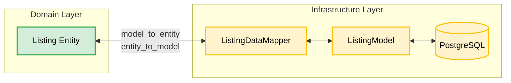

# Chapter 4: The Infrastructure Layer (Repositories & Data Mappers)

Welcome to Chapter 4! In the previous chapters, we built the pure business logic in the **Domain Layer** (Chapters 1 & 2) and orchestrated it using the **Application Layer** (Chapter 3).

But eventually, our data has to hit a hard drive. We need a database. 

This brings us to the **Infrastructure Layer** — the outermost circle of Clean Architecture. This is where we deal with SQLAlchemy, PostgreSQL, external APIs, and all the dirty, real-world details that our Domain strictly does not want to know about.

---

## Part 1: The Ports and Adapters Pattern

In Clean Architecture, the Domain defines what it *needs* via abstract interfaces, and the Infrastructure provides the concrete *implementation*. This is formally called **Ports and Adapters** (or Hexagonal Architecture).

### 📚 Book Reference
> **Cosmic Python, Chapter 2 & 3**: *"Repository Pattern"* and *"Coupling and Abstractions"*
> Explains how repositories act as a collection of in-memory objects, abstracting away the database.

### The Port (Domain Layer)

A **Port** is an abstract interface. Open [src/modules/bidding/domain/repositories.py](../src/modules/bidding/domain/repositories.py):

```python
class ListingRepository(GenericRepository[GenericUUID, Listing], ABC):
    """An interface for Listing repository"""
```

This interface agrees to a simple contract inherited from `GenericRepository`:
- `add(entity)`
- `get_by_id(id)`
- `remove(entity)`

Notice there is **no `save()` or `update()` method**. A Repository is meant to act like an in-memory Python list or dictionary. When you get an item from a list and change its property, you don't call `list.save()` — the object is just updated in memory. The infrastructure handles persisting those changes silently.

### The Adapter (Infrastructure Layer)

An **Adapter** plugs into the Port to do the actual work. Open [src/modules/bidding/infrastructure/listing_repository.py](../src/modules/bidding/infrastructure/listing_repository.py):

```python
class PostgresJsonListingRepository(SqlAlchemyGenericRepository, ListingRepository):
    """Listing repository implementation"""

    mapper_class = ListingDataMapper
    model_class = ListingModel
```

By inheriting from both `SqlAlchemyGenericRepository` (the concrete SQLAlchemy logic) and `ListingRepository` (the abstract Domain port), this adapter fulfills the contract while keeping the SQL code completely isolated from the Domain.

---

## Part 2: Database Models vs. Domain Entities

One of the biggest mistakes in standard MVC frameworks (like Django or basic FastAPI tutorials) is using the *exact same class* for your database model and your business logic.

**Why is that bad?**
Because databases care about foreign keys, nullability, constraints, and relational normal forms. Business logic cares about behavior, invariants, and domain rules. When you mix them, you compromise your design.

**Clean Architecture strictly separates them:**
1. **`Listing` (Domain Entity)** — Pure Python, enforces business rules.
2. **`ListingModel` (Database Model)** — Pure SQLAlchemy, defines database tables.

### The SQLAlchemy Model & The JSONB Pattern

Look at `ListingModel` in [src/modules/bidding/infrastructure/listing_repository.py](../src/modules/bidding/infrastructure/listing_repository.py):

```python
class ListingModel(Base):
    """Data model for listing domain object in the bidding context"""

    __tablename__ = "bidding_listing"
    id = Column(UUIDType(binary=False), primary_key=True, default=uuid.uuid4)
    data = Column(mutable_json_type(dbtype=JSONB, nested=True), nullable=False)
```

Notice something crazy? **There are no SQL columns for `ask_price`, `starts_at`, or `bids`!**

This codebase uses an advanced pattern optimized for DDD: **Document Storage in PostgreSQL**. Instead of creating 15 columns for every property, the entire state of the Aggregate Root is serialized into a single `JSONB` column named `data`.

**Why this is brilliant for DDD:**
1. **Aggregates are saved as a single unit.** When you save a Listing, you save its bids too. No complex `has_many` relationships or join tables required.
2. **No Migrations for Domain Changes.** If you add a new property to the `Listing` entity, you don't need to run `alembic upgrade head`. It's just automatically added to the JSON document.

---

## Part 3: The Data Mapper

If the Domain returns a `Listing` Entity, but SQLAlchemy needs a `ListingModel`, how do we translate between them? 

**The Data Mapper.**

Look at `ListingDataMapper` in the same `listing_repository.py` file:

```python
class ListingDataMapper(DataMapper[Listing, ListingModel]):
    entity_class = Listing
    model_class = ListingModel

    def model_to_entity(self, instance: ListingModel) -> Listing:
        # 1. Extract raw data from JSON
        data = instance.data.copy()
        
        # 2. Deserialize into Value Objects
        ask_price = Money(**data.pop("ask_price"))
        bids = [deserialize_bid(b) for b in data.pop("bids", [])]
        
        # 3. Construct the pure Domain Entity
        return Listing(
            id=instance.id,
            ask_price=ask_price,
            bids=bids,
            ...
        )

    def entity_to_model(self, entity: Listing) -> ListingModel:
        # 1. Serialize Entity into a dictionary
        return ListingModel(
            id=entity.id,
            data={
                "ask_price": serialize_money(entity.ask_price),
                "bids": [serialize_bid(b) for b in entity.bids],
                ...
            },
        )
```

### Flow Visualization



---

## Part 4: The Identity Map and Unit of Work

Remember earlier when we said Repositories don't have a `save()` method? How do changes actually get written to the database?

The secret lies in the **Identity Map** and the **Unit of Work**.

Open [src/seedwork/infrastructure/repository.py](../src/seedwork/infrastructure/repository.py) and look at `SqlAlchemyGenericRepository`:

```python
class SqlAlchemyGenericRepository(GenericRepository[GenericUUID, Entity]):
    def __init__(self, db_session: Session, identity_map=None):
        self._session = db_session
        self._identity_map = identity_map or dict()
```

### 1. The Identity Map tracks loaded objects
When you load a Listing from the repository (`repo.get_by_id()`), the repository saves a reference to it in the `self._identity_map` dictionary. If you ask for the *same* Listing again during the same request, it returns the exact same Python object from memory, preventing redundant DB calls.

### 2. Persist All (The Unit of Work)
When an Application handler finishes successfully, the `TransactionContext` (from Chapter 3) automatically calls `repo.persist_all()`.

```python
    def persist_all(self):
        """Persists all changes made to entities known to the repository (present in the identity map)."""
        for entity in self._identity_map.values():
            if entity is not REMOVED:
                self.persist(entity)
```

It loops over **every single entity** it has tracked in memory, maps it back into a `ListingModel`, and merges those changes into the SQLAlchemy session.

**Why this feels like magic:**
You just write your business logic in the handler:
```python
listing = repo.get_by_id(command.listing_id)
listing.place_bid(bid)
# ... do nothing else!
```
The repository "knows" you loaded that listing. It tracked it. When the transaction finishes, it automatically persists the mutated state to PostgreSQL.

---

## Part 5: Testing the Infrastructure Layer (Unit vs Integration)

How do we test this layer? Because it contains both pure logic (Data Mappers) and database I/O (Repositories), we use **two different types of tests**.

Open [src/modules/bidding/tests/infrastructure/test_listing_repository.py](../src/modules/bidding/tests/infrastructure/test_listing_repository.py).

### 1. Unit Tests for Data Mappers
Data mappers are just pure Python functions that convert objects into dictionaries and back. They don't need a database!

```python
@pytest.mark.unit
def test_listing_data_mapper_maps_entity_to_model():
    listing = Listing(...) # Create domain entity
    mapper = ListingDataMapper()
    
    actual = mapper.entity_to_model(listing)
    
    # Assert the resulting ListingModel has the correct JSON data
    assert actual.data["ask_price"]["amount"] == 100
```
- **Marker:** `@pytest.mark.unit`
- **Speed:** Instantaneous (milliseconds)
- **Benefit:** Proves the serialization logic is perfect without docker-compose overhead.

### 2. Integration Tests for Repositories
To test if SQLAlchemy actually saves the `ListingModel` to PostgreSQL, we must hit a real database.

```python
@pytest.mark.integration
def test_listing_persistence(db_session): # <- Injects a real DB session
    original = Listing(...)
    repository = PostgresJsonListingRepository(db_session=db_session)

    repository.add(original)
    repository.persist_all() # Flush to DB

    # Reload from DB using a fresh repository
    repository = PostgresJsonListingRepository(db_session=db_session)
    persisted = repository.get_by_id(original.id)

    assert original == persisted
```
- **Marker:** `@pytest.mark.integration`
- **Speed:** Slower (requires DB connection, table creation, I/O)
- **Benefit:** Proves the ORM, the Database, and the Data Mapper all work together in harmony.

### 3. Running the Tests

The test code executed by the commands below can be found here: [test_listing_repository.py](../src/modules/bidding/tests/infrastructure/test_listing_repository.py).

To run the fast, pure-Python unit tests for this layer (no database required):
```bash
poe test_unit -k "infrastructure"
```

To run the slower integration tests that verify database persistence (requires Docker database):
```bash
poe test_integration -k "infrastructure"
```

To run all infrastructure tests together:
```bash
poe test_infrastructure
```

---

## 🧪 Hands-On Exercise #4

### Exercise 4A: Trace the Serialization
1. Open [listing_repository.py](../src/modules/bidding/infrastructure/listing_repository.py)
2. Look at the `serialize_bid` and `deserialize_bid` helper functions located near the top of the file.
3. **Question:** Why do we need custom serialization functions for `Bid` instead of just calling Python's built-in `json.dumps(bid.__dict__)`? *(Hint: Look at the data types used for `placed_at` (datetime) and `max_price` (Money) inside the `Bid` value object).*

### Exercise 4B: Event Extraction
1. Open [seedwork/infrastructure/repository.py](../src/seedwork/infrastructure/repository.py)
2. Look at the `collect_events()` method on the `SqlAlchemyGenericRepository`.
3. **Question:** How does the event dispatcher (from Chapter 3) actually get the Domain Events that were recorded inside the Entity? Where does the repository pull them from?

### Exercise 4C: Break the Mapper
1. Open the integration tests: `poe test_infrastructure`
2. Change the `ListingDataMapper` so that it misspells the `"ask_price"` key when mapping to JSON.
3. Run the tests again. Notice which tests fail instantly (the unit tests) vs which fail during database operations (the integration tests).

---

## Summary

| Concept | Purpose | Codebase Location |
|---|---|---|
| **Port** | The interface the Domain needs | `domain/repositories.py` |
| **Adapter** | The concrete implementation | `infrastructure/listing_repository.py` |
| **Database Model** | SQLAlchemy definition (JSONB) | `ListingModel` |
| **Data Mapper** | Translates Models ↔ Entities | `ListingDataMapper` |
| **Identity Map** | In-memory tracker of loaded entities | `self._identity_map` |
| **Persist All** | Auto-saves entities at transaction end | `repo.persist_all()` |

### The Golden Rules of Infrastructure

1. **Domain Entities are ignorant of the database.** They do not inherit from `Base` or `Model`. They know nothing about SQL.
2. **Infrastructure depends on Domain, not the reverse.** The adapter implements the Domain's port and maps models into the Domain's entities.
3. **Changes are tracked automatically.** You retrieve an aggregate, change it, and the infrastructure's Unit of Work handles persistence implicitly.

> [!NOTE]
> This completes the core architecture (Domain, Application, and Infrastructure)! 
> 
> Let me know when you are ready for **Chapter 5**, where we cover **Testing Strategies (TDD)** and how we test pure domain logic without spinning up a database.
