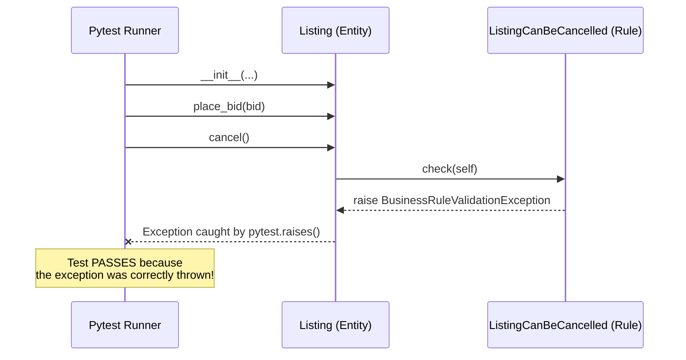

# Chapter 5: TDD in Action (Testing the Domain)

Welcome to Chapter 5! After a brief detour into the Infrastructure Layer in Chapter 4, we are returning to the very core of our application: **The Domain**.

This chapter is all about **Test-Driven Development (TDD)**. TDD is often misunderstood as simply "writing tests before code," but in Clean Architecture, TDD is the primary tool for *designing* your Domain.

---

## Part 1: Why Domain Tests Are Special (Unit vs Integration)

In Chapter 4, we ran integration tests for our Repositories. Those tests required a running PostgreSQL database (via Docker), they took a few seconds to run, and they tested how different layers wired together.

Domain Unit Tests are fundamentally different:

| Feature | Domain Unit Tests | Infrastructure Integration Tests |
| :--- | :--- | :--- |
| **Dependencies** | **Zero.** No database, no API, no FastAPI. | PostgreSQL, SQLAlchemy, Docker. |
| **Speed** | **Blindingly Fast** (milliseconds for 100s of tests) | Slow (seconds for a few tests) |
| **Purpose** | Proving business rules (e.g., "Cannot bid less than current price") | Proving plumbing works (e.g., "Saves to DB correctly") |
| **Marker** | `@pytest.mark.unit` | `@pytest.mark.integration` |

Because Domain objects (Entities and Value Objects) are pure Python classes with no database dependencies, we can instantiate them directly in memory, call their methods, and assert the results instantly.

---

## Part 2: Anatomy of a Domain Test

Let's look at a real test from our codebase. 

📄 **File Reference:** [test_bidding.py](../src/modules/bidding/tests/domain/test_bidding.py)

Open the file and find the test `test_place_two_bids_second_buyer_outbids()`.

```python
@pytest.mark.unit
def test_place_two_bids_second_buyer_outbids():
    now = datetime.utcnow()
    
    # 1. Arrange: Setup the domain objects purely in memory
    seller = Seller(id=GenericUUID(int=1))
    bidder1 = Bidder(id=GenericUUID(int=2))
    bidder2 = Bidder(id=GenericUUID(int=3))
    listing = Listing(
        id=GenericUUID(int=4),
        seller=seller,
        ask_price=Money(10),
        starts_at=now,
        ends_at=now,
    )
    
    # Assert initial state
    assert listing.current_price == Money(10)
    assert listing.next_minimum_price == Money(11)

    # 2. Act: Bidder 1 places a bid
    listing.place_bid(Bid(bidder=bidder1, max_price=Money(15), placed_at=now))
    
    # Assert intermediate state
    assert listing.current_price == Money(10)
    assert listing.next_minimum_price == Money(11)

    # 3. Act: Bidder 2 successfully outbids Bidder 1
    listing.place_bid(Bid(bidder=bidder2, max_price=Money(30), placed_at=now))
    
    # Assert final state
    assert listing.current_price == Money(15)
    assert listing.next_minimum_price == Money(16)
    assert listing.highest_bid == Bid(Money(30), bidder=bidder2, placed_at=now)
```

Notice how clean this is? There is no `repo.add()`, no `session.commit()`, and no mock database connections. We just create Python objects, run a method, and check properties. 

This is the beauty of pushing your business logic into the Domain layer: **it becomes incredibly easy to test.**

---

## Part 3: Testing Business Rules (Exceptions)

A massive part of Domain modeling is ensuring invalid states cannot exist. When an invariant is violated, the Domain throws a `BusinessRuleValidationException` (which we learned about in Chapter 2).

How do we test that a rule properly blocks an action? We use `pytest.raises`.

Look at `test_cannot_cancel_listing_with_bids()` in [test_bidding.py](../src/modules/bidding/tests/domain/test_bidding.py):

```python
@pytest.mark.unit
def test_cannot_cancel_listing_with_bids():
    # 1. Arrange: Setup a listing and place a valid bid on it
    listing = Listing(...)
    bid = Bid(...)
    listing.place_bid(bid)

    # 2. Act & Assert: Attempting to cancel should throw a specific error
    with pytest.raises(BusinessRuleValidationException, match="ListingCanBeCancelled"):
        listing.cancel()
```

If `listing.cancel()` successfully executes without throwing the error, the test **fails**, alerting us that a critical business rule is broken!

---

## Part 4: Visualizing the Pure Python Flow



---

## 🏃‍♂️ 3. Running the Tests

To run the blazingly fast Domain unit tests for the Bidding module:

```bash
poe test_unit src/modules/bidding/tests/domain/
```

To run all Domain tests across the entire project (both Catalog and Bidding):

```bash
poe test_domain
```

*(Try running it right now in your terminal — notice how it finishes in a fraction of a second!)*

---

## 🧪 Hands-On Exercises

### Exercise 5A: Red, Green, Refactor
Let's practice the TDD cycle. 
Currently, there is no rule preventing a `Seller` from bidding on their own `Listing`. Let's fix that!

1. **RED (Write the failing test):**
   Open [test_bidding.py](../src/modules/bidding/tests/domain/test_bidding.py). At the bottom of the file, write a new test called `test_seller_cannot_bid_on_own_listing()`. Create a Listing, create a Bid where the `bidder.id` matches the `seller.id`, and try to `place_bid()`. 
   Run `poe test_domain`. The test should **fail** because the bid will be accepted.

2. **GREEN (Make it pass):**
   Open [domain/rules.py](../src/modules/bidding/domain/rules.py). Create a new class `SellerCannotBidOnOwnListing(BusinessRule)`. Implement the `is_broken()` method to return `True` if `bid.bidder.id == listing.seller.id`.
   Then, wire it into `place_bid()` inside `domain/entities.py`.
   Run `poe test_domain`. The test should now **pass**!

3. **REFACTOR (Clean it up):**
   Look at your new rule and test. Can the variable names be clearer? Tidy them up and run the tests one last time to ensure you didn't break anything.

> [!TIP]
> The beauty of this exercise is that you can implement a core business feature, test it thoroughly, and prove it works—**without ever writing a single line of SQL, touching an API route, or opening Postman.**

---

Let me know when you've successfully completed the exercise, or if you run into any trouble writing the new business rule!
