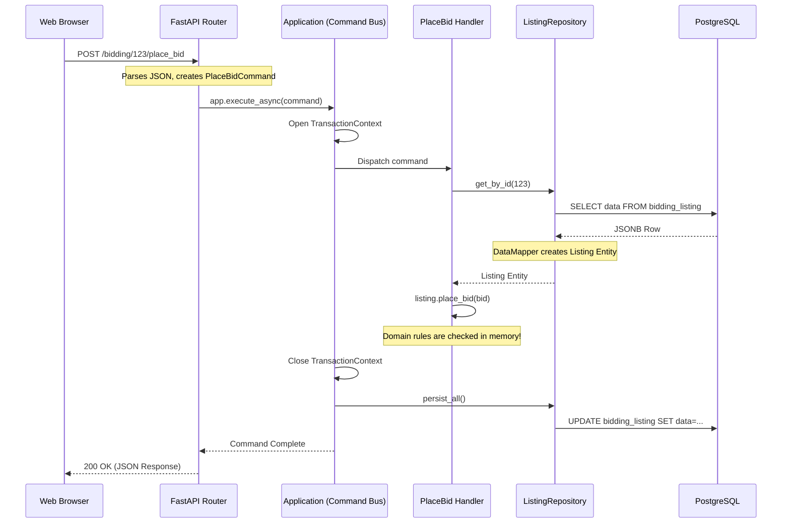

# Chapter 6: Delivery Mechanisms & Dependency Injection

Welcome to Chapter 6! We've built the pure Domain (business rules), wrapped it in an Application Layer (use cases), and connected it to the Infrastructure (database). 

But how does a real user actually interact with our system? 

This brings us to **Delivery Mechanisms**. A delivery mechanism is anything that delivers your application to the outside world. It could be a FastAPI web server, a CLI tool, a GraphQL endpoint, or a background task worker (like Celery).

In Clean Architecture, the delivery mechanism is just a "dumb" outer shell. It knows nothing about business rules. Its only job is to translate HTTP requests (or CLI arguments) into Application Commands, and translate Application results back into HTTP responses.

---

## Part 1: Dependency Injection (The Composition Root)

Before our FastAPI app can run, it needs to know how to wire everything together. If an Application handler requires a `ListingRepository`, how does it know to use the `PostgresJsonListingRepository`?

This is solved by **Dependency Injection (DI)**, specifically in a centralized location called the **Composition Root**.

📄 **File Reference:** [config/container.py](../src/config/container.py)

Open `container.py` and look at the `Container` class. We use the `dependency-injector` library to define how our application is built.

```python
class Container(containers.DeclarativeContainer):
    # 1. Configuration (Environment variables)
    config = providers.Configuration()
    
    # 2. Infrastructure (Singletons)
    engine = providers.Singleton(create_engine_once, config)
    session_factory = providers.Singleton(create_session_factory, engine)
    
    # 3. Application modules
    catalog_module = providers.Singleton(create_catalog_module)
    bidding_module = providers.Singleton(create_bidding_module)
    
    # 4. The main Lato Application (Event Dispatcher & Command Bus)
    application = providers.Singleton(
        create_application,
        catalog_module=catalog_module,
        bidding_module=bidding_module,
    )
```

At application startup, this container is initialized. It reads the `.env` variables, creates exactly one database `engine` (a Singleton), creates the modules, and assembles the `Application` object.

This is extremely powerful because if we want to swap PostgreSQL for MongoDB in the future, we don't have to touch 50 different files. We only change the provider in `container.py`.

---

## Part 2: The Delivery Mechanism (FastAPI Routers)

Let's look at how an incoming HTTP request actually triggers a domain action.

📄 **File Reference:** [api/routers/bidding.py](../src/api/routers/bidding.py)

Find the `place_bid` POST route:

```python
@router.post("/bidding/{listing_id}/place_bid", response_model=BiddingResponse)
@inject
async def place_bid(
    listing_id,
    request_body: PlaceBidRequest,
    app: Annotated[Application, Depends(get_application)], # <-- DI at work!
):
    # 1. Translate the HTTP request into a pure Application Command
    command = PlaceBidCommand(
        listing_id=GenericUUID(str(listing_id)),
        bidder_id=GenericUUID(str(request_body.bidder_id)),
        amount=request_body.amount,
    )
    
    # 2. Hand it off to the Application Layer (The Command Bus)
    await app.execute_async(command)
    
    # 3. Run a Query to get the new state
    query = GetBiddingDetails(listing_id=listing_id)
    result = await app.execute_async(query)
    
    # 4. Return an HTTP response (FastAPI handles JSON serialization automatically)
    return BiddingResponse(
        listing_id=result.id,
        auction_end_date=result.ends_at,
        bids=[...],
    )
```

Notice what is **NOT** here:
- There is no SQLAlchemy `session.commit()`.
- There are no business rules checking if the bid is high enough.
- There is no error handling for domain exceptions (this is handled globally in `src/api/main.py`).

The route is incredibly thin. It just translates HTTP → Command, and Result → HTTP.

---

## Part 3: Visualizing the Full Request Flow

Here is the complete journey of a request from the outside world down to the database and back, crossing all the boundaries of Clean Architecture.



---

## Part 4: API End-to-End Tests (E2E Integration)

We tested our Domain purely in memory (Chapter 5), and we tested our Repositories against the DB (Chapter 4). Now, we must test the entire stack from the outside in.

📄 **File Reference:** [api/tests/test_bidding.py](../src/api/tests/test_bidding.py)

API tests simulate a real user sending HTTP requests. They require the entire FastAPI application, the Dependency Injector, and the Docker database to be running.

```python
@pytest.mark.integration
@pytest.mark.asyncio
async def test_place_bid(app, api_client):
    # 1. Arrange: Setup the initial DB state using a helper function
    listing_id = GenericUUID(int=1)
    seller_id = GenericUUID(int=2)
    bidder_id = GenericUUID(int=3)
    await setup_app_for_bidding_tests(app, listing_id, seller_id, bidder_id)

    # 2. Act: Place a bid via the API Client
    url = f"/bidding/{listing_id}/place_bid"
    response = api_client.post(url, json={"bidder_id": str(bidder_id), "amount": 11})
    
    # 3. Assert: Check the HTTP status code
    json = response.json()
    if response.status_code != 200:
        raise Exception(f"API Error: {json}")
```

### Running API Tests

Because these tests touch every single layer (API → App → Domain → Infra → DB), they are the slowest but offer the highest confidence that the system works as a whole.

```bash
# Run all API tests
poe test_integration -k "api"
```

---

## 🧪 Hands-On Exercises

### Exercise 6A: Tracing the Dependency Injection
1. Open [config/container.py](../src/config/container.py).
2. Look at how `SqlAlchemyGenericRepository` is provided. How does the system know to provide a `PostgresJsonListingRepository` when a handler asks for the abstract `ListingRepository`?
3. *(Hint: Look closely at `dependency_provider` inside the `TransactionContainer` class at the bottom of the file).*

### Exercise 6B: Add a Fast Fail to the Router
Currently, if someone sends an invalid bid amount (like a negative number), the application waits until the request reaches the Domain layer to fail. 
1. Open [api/models/bidding.py](../src/api/models/bidding.py).
2. Modify the `PlaceBidRequest` Pydantic model. Add a Pydantic `Field(gt=0)` to the `amount` property so that FastAPI rejects negative bids immediately with a `422 Unprocessable Entity` before the request even reaches the Application layer.
3. Start the API (`poe start`) and try to submit a negative bid via the Swagger UI (`http://localhost:8000/docs`).

> [!NOTE]
> Congratulations! You have now traced the entire architecture of a Python DDD application from the outer HTTP shell down to the deepest Domain business rules. You are ready to start refactoring real-world monolithic codebases into this enterprise-grade structure!
