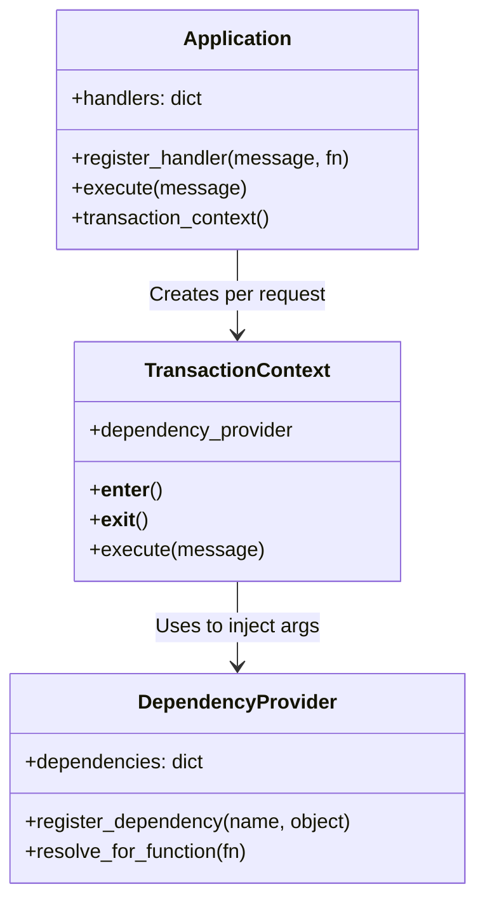

# Chapter 7: The Foundation (Message & Command Bus)

Welcome to Chapter 7! In this bonus chapter, we will pull back the curtain on the **`seedwork/foundation/`** package. 

You might remember that this package used to be an external library called `lato`. We copied its source code directly into our project because building a bespoke **Message Bus / Command Bus** inside `seedwork` is exactly what the *Cosmic Python* architecture recommends. 

By having this logic inside our own codebase, we eliminate third-party lock-in and have total control over how transactions and events are handled.

---

## Part 1: What is the Foundation?

In a DDD Clean Architecture, the Web API (FastAPI) isn't allowed to talk directly to the Database, and it shouldn't be orchestrating business rules either. Instead, the Web API creates a "Command" and throws it into the void.

The **Foundation** is the invisible plumbing that catches that Command, figures out which Application Handler is supposed to execute it, wires up the database connection, runs the handler, and then catches any Domain Events that were emitted and passes them to their respective Event Handlers.

### The Big Three Components

The Foundation relies on three main pillars:
1. **`Application`**: The central registry. It holds a list of all your commands, events, and the functions (handlers) that are supposed to run when those messages are dispatched.
2. **`DependencyProvider`**: A dictionary-like object that figures out what arguments a handler needs (like a `ListingRepository`) and injects them automatically so you don't have to pass them manually.
3. **`TransactionContext`**: A context manager that groups database operations together. If the command succeeds, it commits. If it fails, it rolls back.

---

## Part 2: How It Fits Together (Visualized)

Here is a Mermaid diagram showing how these three components interact when a command is dispatched.



---

## Part 3: Deep Dive into the Code

Let's look at how the Foundation actually works under the hood.

### 1. Registering Handlers
📄 **File Reference:** [src/seedwork/foundation/application_module.py](../src/seedwork/foundation/application_module.py)

When you write a command handler in your application layer, you decorate it with `@bidding_module.handler()`. This decorator registers the function in a dictionary inside the module. Later, the main `Application` consumes this dictionary.

```python
# In src/modules/bidding/application/__init__.py
bidding_module = ApplicationModule("bidding")

# In src/modules/bidding/application/command/place_bid.py
@bidding_module.handler(PlaceBidCommand)
def place_bid(command: PlaceBidCommand, repository: ListingRepository): ...
```
When `Application.execute(PlaceBidCommand)` is called, the Foundation looks up `PlaceBidCommand` in its dictionary, finds the `place_bid` function, and gets ready to run it.

### 2. Magic Dependency Injection
📄 **File Reference:** [src/seedwork/foundation/dependency_provider.py](../src/seedwork/foundation/dependency_provider.py)

Before the Foundation runs the `place_bid` function, it inspects the function's signature using Python's built-in `inspect.signature`. It sees that the function requires a `command` and a `ListingRepository`.

It already has the `command`. For the `ListingRepository`, it asks the **DependencyProvider** if it has an instance of `ListingRepository` registered. If it does, it dynamically passes it in!

```python
# Pseudo-code of how the provider works
import inspect

def resolve_and_call(fn, message, provider):
    sig = inspect.signature(fn)
    kwargs = {}
    for param_name, param in sig.parameters.items():
        if param.annotation == type(message):
            kwargs[param_name] = message
        elif param.annotation in provider:
            kwargs[param_name] = provider[param.annotation]
            
    return fn(**kwargs) # Automatically injects the repository!
```

### 3. The Transaction Context (Unit of Work)
📄 **File Reference:** [src/seedwork/foundation/transaction_context.py](../src/seedwork/foundation/transaction_context.py)

We don't want a database connection to stay open forever. The `TransactionContext` represents a single "Unit of Work" (UoW). 

When you call `app.transaction_context()`, it creates an isolated bubble. Any events emitted during this bubble are collected. When the bubble closes (at the end of the `with` block), it publishes all the collected events and commits the database transaction.

### 4. Testing Utilities (Unused but Available)
📄 **File Reference:** [src/seedwork/foundation/testing.py](../src/seedwork/foundation/testing.py)

The `testing.py` file provides two context managers — `override_app` and `override_ctx` — designed to temporarily swap out real dependencies (like a database-backed `ListingRepository`) with fakes or mocks during a test.

> [!IMPORTANT]
> **These utilities are NOT actually used anywhere in this codebase!** They exist as helper tools waiting to be leveraged. Currently, the project's application-layer tests (e.g., in `modules/catalog/tests/application/`) spin up a real test database instead of using in-memory fakes.
>
> Writing tests that use `override_ctx` with in-memory repositories would be a great future improvement (see item #6 in [improvements.md](./improvements.md)). It would allow you to test the full Application flow (Command → Handler → Domain → Repository) in milliseconds, without any database I/O.

Here is what a hypothetical test *could* look like if you implemented this pattern:

```python
from seedwork.foundation.testing import override_ctx

def test_place_bid_use_case(app, fake_listing_repo):
    # Hypothetical: swap the real DB repo for a fast in-memory fake
    with override_ctx(app, repository=fake_listing_repo):
        app.execute(PlaceBidCommand(...))
        
    assert fake_listing_repo.saved_listing is not None
```

This pattern is powerful because the Foundation's `DependencyProvider` does all the wiring — `override_ctx` just temporarily replaces what gets injected.

---

## Part 4: Testing the Foundation

> [!WARNING]
> **Deprecated Tests!** 
> If you look in `src/seedwork/tests/application/`, you will notice that the tests (like `test_application.py`) are actually skipped via `@pytest.mark.skip`. 
> 
> Why? Because the original `python-ddd` project had an older, custom-built application bus. When the author swapped it out for the `lato` library, they deprecated the old tests. Since we have just internalized `lato` back into `foundation`, an excellent future improvement would be to write a fresh suite of tests targeting the new `foundation` components to ensure they behave exactly as expected!

> [!NOTE]
> The Foundation is complex, but its beauty lies in its strict boundaries. By keeping this logic in `seedwork/foundation`, the rest of your business logic (`modules/`) remains incredibly simple, completely decoupled, and highly testable!
