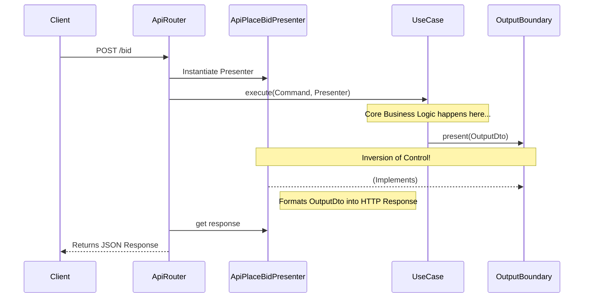

# Chapter 8: Output Boundaries and Presenters

In clean architecture, the **Application Layer** (Use Cases, Commands, Queries) must remain completely decoupled from the **Delivery Mechanism** (HTTP APIs, CLIs, WebSockets, or UI rendering). 

If a Use Case returns raw JSON dictionaries or ties itself to HTTP status codes, it violates the Dependency Rule. To solve this, we use the **Output Boundary** pattern.

## The Concept

1. **Output Boundary (Interface):** An abstract interface defined inside the Application layer. It dictates *what* information the Use Case will emit when it finishes, without specifying *how* it should be formatted.
2. **Output DTO (Data Transfer Object):** A DTO is a simple, "dumb" data structure containing only fields and no business logic. Its sole purpose is to safely carry the raw data emitted by the Use Case out to the delivery layer without exposing the complex Domain Entities.
3. **Presenter (Adapter):** A concrete class living in the outermost layer (e.g., the API router). It implements the Output Boundary interface. Its job is to take the Output DTO and format it appropriately for the delivery mechanism (e.g., converting a boolean and a decimal into a specific JSON `PlaceBidResponse` model, or discarding it for an HTML redirect).

## Flow of Control vs Flow of Dependency

This pattern perfectly illustrates **Dependency Inversion**:



Notice that the Use Case calls `present()` on the **Output Boundary**. The Use Case has no idea that the `ApiPlaceBidPresenter` exists. This means we could easily swap `ApiPlaceBidPresenter` with a `CliPresenter` without changing a single line of business logic!

### FAQ: Why are the Boundary and DTO defined in the Application folder?
It might feel counter-intuitive. Since the API router is the one that actually formats the response, shouldn't the DTO and Boundary live in the `src/api/` folder? 

**No, because of the Dependency Rule.** In ports and adapters architecture, the layer that *calls* an interface is the one that defines it.
- If the Boundary was defined in the API layer, the Use Case would have to import it from the API layer. This means our core business logic would depend on the web framework!
- By defining the `PlaceBidOutputBoundary` interface right next to the Command handler, the Application layer dictates the contract. The Delivery layer (API) must reach *inwards* and implement that contract.

This forces the API to depend on the Business Logic, rather than the Business Logic depending on the API.

## The Complete Implementation

Here is how the pattern is fully implemented for the `place_bid` use case, from the innermost boundary to the outermost router.

**1. Define the Boundary and DTO (Application Layer):**
*File: [src/modules/bidding/application/command/place_bid.py](../src/modules/bidding/application/command/place_bid.py)*
```python
@dataclass
class PlaceBidOutputDto:
    is_winner: bool
    current_price: Money

class PlaceBidOutputBoundary(abc.ABC):
    @abc.abstractmethod
    def present(self, output_dto: PlaceBidOutputDto) -> None:
        pass
```

**2. Inject and use the Boundary in the Use Case (Application Layer):**
*File: [src/modules/bidding/application/command/place_bid.py](../src/modules/bidding/application/command/place_bid.py)*
```python
@bidding_module.handler(PlaceBidCommand)
async def place_bid(
    command: PlaceBidCommand, 
    presenter: PlaceBidOutputBoundary # Injected dependency!
):
    # ... business logic executes ...
    
    # Blindly pass the DTO to the boundary
    presenter.present(
        PlaceBidOutputDto(is_winner=is_winning, current_price=auction.current_price)
    )
```

**3. Implement the Presenter (Infrastructure/API Layer):**
*File: [src/api/routers/bidding.py](../src/api/routers/bidding.py)*
```python
class ApiPlaceBidPresenter(PlaceBidOutputBoundary):
    def __init__(self):
        self.response = None
        
    def present(self, dto: PlaceBidOutputDto) -> None:
        # Formats the raw business data into the specific FastAPI Pydantic Response
        self.response = PlaceBidResponse(
            is_winning=dto.is_winner,
            current_price=dto.current_price.amount
        )
```

**4. Tie it all together in the Router (Infrastructure/API Layer):**
*File: [src/api/routers/bidding.py](../src/api/routers/bidding.py)*
```python
@router.post("/bidding/{listing_id}/place_bid", response_model=PlaceBidResponse)
async def place_bid_endpoint(
    # ... inputs ...
    ctx: TransactionContext = Depends(get_transaction_context)
):
    # Create the command
    command = PlaceBidCommand(...)
    
    # 1. Instantiate the specific Presenter we want
    presenter = ApiPlaceBidPresenter()
    
    # 2. Inject it into the transaction context
    ctx.set_dependency("presenter", presenter)
    
    # 3. Execute the command
    await ctx.execute_async(command)
    
    # 4. Grab the correctly formatted response from the presenter
    return presenter.response
```

### FAQ: How does the Presenter actually get injected at runtime?
If you look at the framework setup in `src/config/container.py`, you will notice that the `ApiPlaceBidPresenter` is **never registered** in the dependency injection container! So how does the Use Case find it?

The magic happens in the `TransactionContext`. 
Because a Presenter is highly contextual (we want a brand new Presenter for every single HTTP request so responses don't get mixed up), we don't register it globally. Instead, we use **Dynamic Dependency Injection**:

1. In the router, we call `ctx.set_dependency("presenter", presenter)`. This explicitly registers our specific Presenter instance into the current transaction's local memory.
2. When we call `await ctx.execute_async(command)`, the foundation (inside `src/seedwork/foundation/application.py`) inspects the signature of the `place_bid` Use Case.
3. It sees the `presenter` parameter, checks the local `TransactionContext` for a dynamic dependency named "presenter", finds the one we just injected, and passes it in!

*(Note: If you accidentally use `app.execute_async()` instead of `ctx.execute_async()`, a brand new, empty TransactionContext is created, and the Use Case will crash because it loses access to the dynamically injected presenter!)*

## Testing Benefits (Unit vs Integration)

The Presenter pattern drastically improves our testing strategy.

Without a presenter, the only way to test what the `place_bid` Use Case returned was to write an **Integration Test**. You had to spin up the FastAPI `TestClient`, fire an HTTP request, and parse the JSON string response.

With the Presenter pattern, we can now write blisteringly fast **Unit Tests** for the Application Layer using a **Mock Presenter**:

```python
class MockPlaceBidPresenter(PlaceBidOutputBoundary):
    def __init__(self):
        self.presented_dto = None

    def present(self, output_dto: PlaceBidOutputDto) -> None:
        self.presented_dto = output_dto

@pytest.mark.asyncio
async def test_place_bid_emits_output_dto(app):
    # 1. Create a fake presenter
    mock_presenter = MockPlaceBidPresenter()
    app.set_dependency("presenter", mock_presenter)
    
    # 2. Execute command
    await app.execute_async(command)
    
    # 3. Assert against the raw python object! No HTTP client needed!
    assert mock_presenter.presented_dto.is_winner is True
    assert mock_presenter.presented_dto.current_price.amount == 100
```

This perfectly isolates the Use Case logic from the delivery mechanism, ensuring our business rules can be unit tested without ever loading FastAPI.

**How to run these tests:**

To run all Application Layer unit tests (including the presenter tests):
```bash
poe test_application
```

To run specifically the `test_presenters.py` file:
```bash
pytest src/modules/bidding/tests/application/test_presenters.py
```

---

## Command vs Query Presenters

When we apply the Output Boundary / Presenter pattern to **Queries** (e.g. `GetAllListings` or `GetListingDetails`), we notice a distinct difference in how the Web UI presenters behave compared to **Commands**.

### Command Presenters (e.g., `PlaceBidCommand`)
When the Web UI executes a Command (like placing a bid), it doesn't actually care about the returned data. It just wants to know if the command succeeded so it can redirect the user to a new page.
Therefore, the Web Presenter for a Command is often a "Dummy":
```python
class WebPlaceBidPresenter(PlaceBidOutputBoundary):
    def present(self, output_dto: PlaceBidOutputDto) -> None:
        pass  # Web UI ignores the data and redirects
```

### Query Presenters (e.g., `GetAllListings`)
When the Web UI executes a Query, its entire purpose is to retrieve data to render an HTML page. 
Therefore, the Web Presenter for a Query MUST capture the data so the router can pass it into the Jinja template:
```python
class WebGetAllListingsPresenter(GetAllListingsOutputBoundary):
    def __init__(self):
        self.response = None
        
    def present(self, output_dto: list[dict]) -> None:
        self.response = output_dto  # Must capture the data!
        
# In the router:
listing_presenter = WebGetAllListingsPresenter()
ctx.set_dependency("presenter", listing_presenter)
await ctx.execute_async(query)

# Now we have the data for Jinja!
return templates.TemplateResponse(
    "catalog.html", 
    {"listings": listing_presenter.response} 
)
```

By enforcing this boundary on Queries as well as Commands, we achieve a **100% pure Application Layer**. It doesn't know about JSON, HTTP Responses, or Jinja2 Templates. It just says, *"Here is my raw business data. Whatever mechanism called me—be it an API, a Web UI, or a terminal script—can format this data however they like."*

---

## The CLI Presenter

To truly prove that our Application Layer is framework-agnostic, we can look at the Command Line Interface (CLI) implementation in `src/cli/__main__.py`.

A CLI doesn't need JSON or HTML; it just needs to print text to the terminal. By defining a `CliGetAllListingsPresenter`, we can reuse the exact same `GetAllListings` Use Case to output data safely to the terminal:

```python
class CliGetAllListingsPresenter(GetAllListingsOutputBoundary):
    def __init__(self):
        self.response = None
        
    def present(self, output_dto: list[dict]) -> None:
        self.response = output_dto

# Execution via CLI:
async with app.transaction_context() as ctx:
    presenter = CliGetAllListingsPresenter()
    ctx.set_dependency("presenter", presenter)
    await ctx.execute_async(GetAllListings())
    
    # Print the raw DTO data nicely to the terminal
    for listing in presenter.response:
        print(f"[{listing['id']}] {listing['title']}")
```

### Why use a CLI in a web application?

In practical commercial situations, you often need to execute business logic outside the context of a user interacting with a website. Common scenarios include:

1. **Cron Jobs & Scheduled Tasks**: Running headless background scripts (e.g., a nightly job to expire old listings, generate invoices, or send marketing emails).
2. **Data Migrations & Backfilling**: Safely seeding a database or migrating data using the actual business rules rather than raw SQL.
3. **Emergency Admin Operations**: Allowing developers to execute commands (like suspending an abusive user) securely from a server terminal when an Admin UI hasn't been built yet.
4. **Message Queue Consumers**: Workers (like Celery) act identically to CLIs; they consume messages in the background and execute Use Cases without any HTTP context.

Because our Application Layer forces Output Boundaries, these background jobs can execute the same core logic as the FastAPI endpoints without crashing or requiring fake HTTP requests!
